# Automating MySQL Backups on AWS EC2 to S3 with WhatsApp Notifications

This guide provides a comprehensive step-by-step process to automate MySQL database backups on an AWS EC2 instance, store them in an S3 bucket, and send a notification via WhatsApp using Twilio. In this document, we’ll walk through the process of automating MySQL database backups on an AWS EC2 instance and storing them in an S3 bucket. This setup will ensure that our data is backed up regularly and securely.

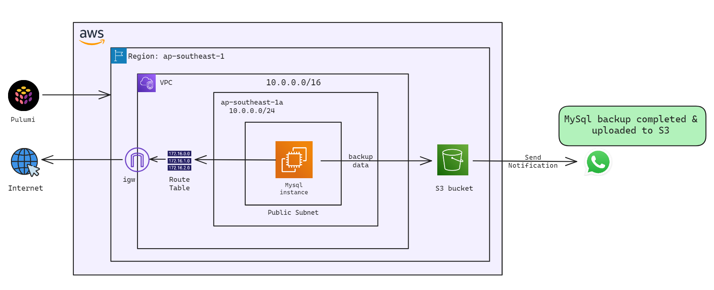

## Prerequisites

1. **AWS Account**: Ensure you have an AWS account.
2. **IAM User Permissions**: The IAM user should have the appropriate permissions for EC2 and S3.
3. **EC2 Instance**: An EC2 instance running Ubuntu or a similar Linux distribution.
4. **Twilio Account**: Sign up for a Twilio account.

## Step 1: Launch an EC2 instance using pulumi

For this project, we need an instance for mysql and other necessary resouces. We will provision an EC2 instance to host MySQL. While the instance will be created in a public subnet for the purpose of this demonstration, it is important to note that deploying MySQL in a public subnet is not recommended due to security concerns.

### Configure AWS CLI

- Configure AWS CLI with the necessary credentials. Run the following command and follow the prompts to configure it:

    ```sh
    aws configure
    ```
    
    This command sets up your AWS CLI with the necessary credentials, region, and output format.

    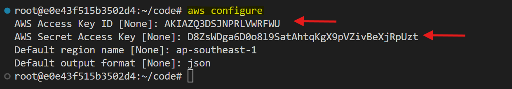

    You will find the `AWS Access key` and `AWS Seceret Access key` on Lab description page,where you generated the credentials

    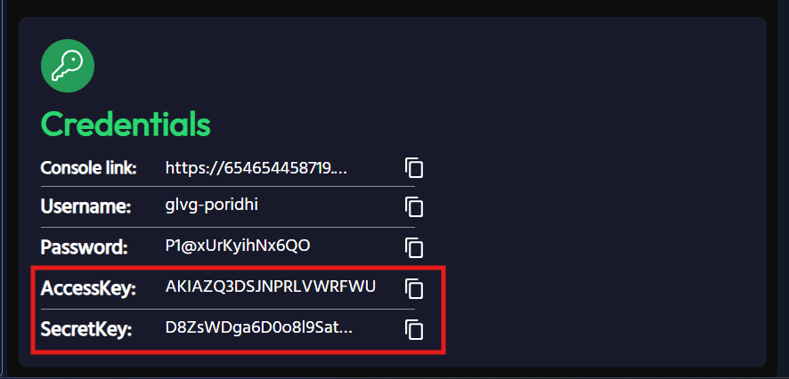


### Set Up a Pulumi Project

1. **Set Up a Pulumi Project**:

- Create a new directory for your project and navigate into it:

    ```sh
    mkdir aws-mysql-infra
    cd aws-mysql-infra
    ```

2. **Initialize a New Pulumi Project**:

- Run the following command to create a new Pulumi project:

    ```sh
    pulumi new aws-javascript
    ```
    Follow the prompts to set up your project.

3. **Create Key Pair**:

- Create a new key pair for our instances using the following command:

    ```sh
    aws ec2 create-key-pair --key-name MyKeyPair --query 'KeyMaterial' --output text > MyKeyPair.pem
    ```

    These commands will create key pair for mysql instance.

4. **Set File Permissions of the key files**:

- **For Linux**:

    ```sh
    chmod 400 MyKeyPair.pem
    ```

### Write Code for infrastructure creation

1. **Open `index.js` file in your project directory**:

   ```js
   const pulumi = require("@pulumi/pulumi");
   const aws = require("@pulumi/aws");

   // Create a VPC
   const vpc = new aws.ec2.Vpc("my-vpc", {
      cidrBlock: "10.0.0.0/16",
      tags: {
         Name: "my-vpc"
      }
   });

   exports.vpcId = vpc.id;

   // Create a public subnet
   const publicSubnet = new aws.ec2.Subnet("public-subnet", {
      vpcId: vpc.id,
      cidrBlock: "10.0.1.0/24",
      availabilityZone: "ap-southeast-1a",
      mapPublicIpOnLaunch: true,
      tags: {
         Name: "public-subnet"
      }
   });

   exports.publicSubnetId = publicSubnet.id;

   // Create an Internet Gateway
   const internetGateway = new aws.ec2.InternetGateway("internet-gateway", {
      vpcId: vpc.id,
      tags: {
         Name: "igw"
      }
   });

   exports.igwId = internetGateway.id;

   // Create a Route Table
   const publicRouteTable = new aws.ec2.RouteTable("public-route-table", {
      vpcId: vpc.id,
      tags: {
         Name: "rt-public"
      }
   });

   // Create a route in the route table for the Internet Gateway
   const route = new aws.ec2.Route("igw-route", {
      routeTableId: publicRouteTable.id,
      destinationCidrBlock: "0.0.0.0/0",
      gatewayId: internetGateway.id
   });

   // Associate the Route Table with the Public Subnet
   const routeTableAssociation = new aws.ec2.RouteTableAssociation("public-route-table-association", {
      subnetId: publicSubnet.id,
      routeTableId: publicRouteTable.id
   });

   exports.publicRouteTableId = publicRouteTable.id;

   // Create a Security Group for the Public Instance
   const publicSecurityGroup = new aws.ec2.SecurityGroup("public-secgrp", {
      vpcId: vpc.id,
      description: "Enable SSH and MySQL access for public instance",
      ingress: [
         { protocol: "tcp", fromPort: 22, toPort: 22, cidrBlocks: ["0.0.0.0/0"] },  // SSH
         { protocol: "tcp", fromPort: 3306, toPort: 3306, cidrBlocks: ["0.0.0.0/0"] },  // MySQL
      ],
      egress: [
         { protocol: "-1", fromPort: 0, toPort: 0, cidrBlocks: ["0.0.0.0/0"] }  // Allow all outbound traffic
      ],
      tags: {
         Name: "public-secgrp"
      }
   });

   // Use the specified Ubuntu 24.04 LTS AMI
   const amiId = "ami-060e277c0d4cce553";

   // Create MySQL Instance
   const mysqlInstance = new aws.ec2.Instance("mysql-instance", {
      instanceType: "t2.micro",
      vpcSecurityGroupIds: [publicSecurityGroup.id],
      ami: amiId,
      subnetId: publicSubnet.id,
      keyName: "MyKeyPair",
      associatePublicIpAddress: true,
      tags: {
         Name: "MySQLInstance",
         Environment: "Development",
         Project: "MySQLSetup"
      }
   });

   exports.mysqlInstanceId = mysqlInstance.id;
   exports.mysqlInstanceIp = mysqlInstance.publicIp;
   exports.mysqlInstanceDns = mysqlInstance.publicDns;
   ```   

### Deploy the Pulumi Stack

1. **Deploy the stack**:

    ```sh
    pulumi up
    ```
    Review the changes and confirm by typing "yes".

### Verify the Deployment

You can verify the created resources such as VPC, Subnet, EC2 instance using AWS console. 

## Step 2: Create an S3 Bucket and Lifecycle Rule

1. **Create an S3 Bucket**:
   - Go to the S3 console.
   - Click "Create bucket" and follow the prompts.
   - Make sure versioning is enabled as going forward we have to apply lifecycle policy on our bucket.

   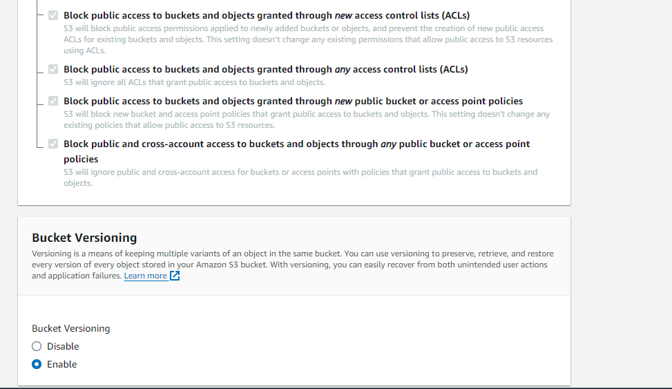
   
2. **Create a Lifecycle Rule**:
   - Navigate to the bucket's "Management" tab.
   - Create a lifecycle rule to expire objects after 3 days.
   - Give name to your lifecycle rule.
   - Choose “Apply to all objects in the bucket” rule scope.
   - Set expiration days to 3 as we will be storing backups of last 3 days.

Click create rule and it’s done.

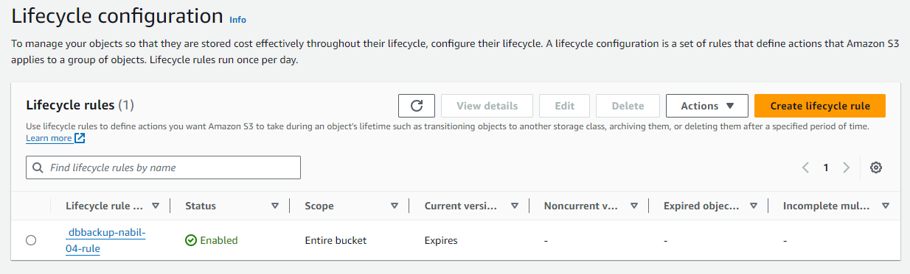

## Step 3: Attach an IAM Role to the EC2 Instance

Let’s create an IAM role with the necessary permissions for EC2 to write to our S3 bucket.

1. **Create an IAM Role**:
   - Go to the IAM console and create a new role.

     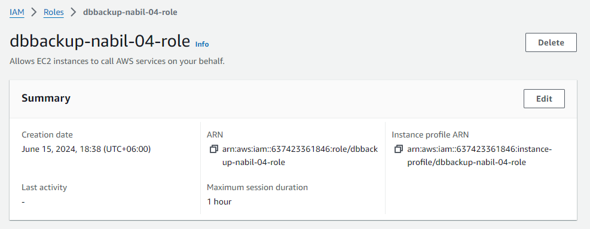

   - Attach the following policy:

   ```json
   {
      "Version": "2012-10-17",
      "Statement": [
         {
               "Effect": "Allow",
               "Action": [
                  "s3:PutObject",
                  "s3:GetObject",
                  "s3:ListBucket"
               ],
               "Resource": [
                  "arn:aws:s3:::your-bucket-name",
                  "arn:aws:s3:::your-bucket-name/*"
               ]
         }
      ]
   }
   ```


   Replace ``your-bucket-name`` with your bucket name.

   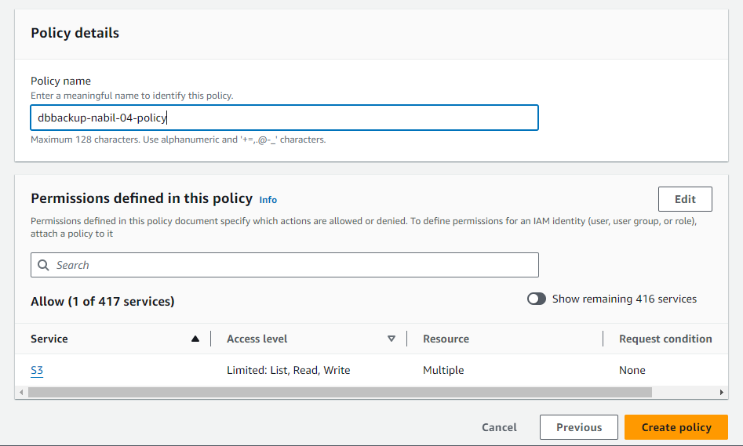

2. **Attach the Role to EC2**:
   - Attach the created IAM role to the EC2 instance in the security and now our server will be able to communicate with the created S3 bucket.

## Step 4: Install MySQL on the EC2 Instance

If MySQL is not already installed on EC2 instance, you can install it using the following commands:

1. **Install MySQL**:
   ```sh
   sudo apt-get update
   sudo apt-get install mysql-server
   ```

## Step 5: Create a Database and Table with Sample Data

Log in to the MySQL server and create a user specifically for performing backups:

1. **Log in to MySQL**:
   ```sh
   sudo mysql -u root
   ```

Then run the following SQL commands to create the database, a table, and insert some sample data:

2. **Create a Database and Table**:
   ```sql
   CREATE DATABASE mystore;
   USE mystore;

   CREATE TABLE product (
       id INT AUTO_INCREMENT PRIMARY KEY,
       name VARCHAR(100),
       price DECIMAL(10,2)
   );

   INSERT INTO product (name, price) VALUES ('Product1', 10.00), ('Product2', 20.00), ('Product3', 30.00);
   ```

## Step 6: Create a Database User for Backups

Create a user specifically for performing backups:

1. **Create Backup User**:
   ```sql
   CREATE USER 'backupuser'@'localhost' IDENTIFIED BY 'User@1234';
   GRANT PROCESS, RELOAD, LOCK TABLES, SHOW DATABASES, REPLICATION CLIENT ON *.* TO 'backupuser'@'localhost';
   FLUSH PRIVILEGES;
   ```

Our database setup is completed and now let’s move forward to the next step of writing backup script.

## Step 7: Set Up Twilio Account

1. **Sign Up for Twilio**:
   - Sign up at [Twilio](https://www.twilio.com/try-twilio).
   - Verify your phone number.

2. **Set Up WhatsApp Sandbox**:
   - Navigate to the [Twilio Sandbox for WhatsApp](https://www.twilio.com/console/sms/whatsapp/sandbox).
   - Follow the instructions to join the sandbox.

3. **Retrieve Credentials**:
   - Note your `Account SID` and `Auth Token` from the Twilio Console.


## Step 8: Install Twilio CLI on EC2 Instance

1. **Create a virtual environment**:

    ```sh
    sudo apt install python3.12-venv
    python3 -m venv venv
    ```

2. **Activate the virtual environment**:

    ```sh
    source venv/bin/activate
    ```

3. **Install the package** within the virtual environment:

    ```sh
    pip install twilio
    ```

4. **Verify the installation**:

    ```sh
    pip list
    ```
    You should see `twilio` in the list of installed packages.

## Step 9: Set Environment Variables in ``.bashrc`` file on your EC2 instance:

1. **Set Environment Variables**:
   
   Open the ``.bashrc`` file with a text editor such as nano or vim.

   ```sh
   nano ~/.bashrc
   ```

   Add the following lines to your `.bashrc`:

   ```sh
   export TWILIO_ACCOUNT_SID="your_account_sid"
   export TWILIO_AUTH_TOKEN="your_auth_token"
   export TO_WHATSAPP_NUMBER="whatsapp:+your_number"
   ```

   Reload the shell configuration:

   ```sh
   source ~/.bashrc
   ```

## Step 10: Write a Backup Script

Create a file ``backup_script.sh`` in the EC2 instance that will handle the database dump.

1. **Create the Script**:
   Create a file `backup_script.sh`:

    ```sh
    #!/bin/bash

    # MySQL database credentials
    DB_USER="backupuser"
    DB_PASS="User@1234"
    DB_NAME="mystore"

    # Directory to store backups temporarily
    BACKUP_DIR="/tmp/mysql_backups"
    mkdir -p $BACKUP_DIR

    # Timestamp for backup filename
    TIMESTAMP=$(date +"%Y%m%d%H%M%S")

    # S3 bucket name
    S3_BUCKET="your-bucket-name"

    # Dump MySQL database
    BACKUP_FILE="$BACKUP_DIR/$DB_NAME-$TIMESTAMP.sql"
    mysqldump -u$DB_USER -p$DB_PASS $DB_NAME > $BACKUP_FILE

    # Upload to S3
    aws s3 cp $BACKUP_FILE s3://$S3_BUCKET/

    # Optional: Remove the local backup file after upload
    rm $BACKUP_FILE

    # Twilio credentials retrieved from environment variables
    TWILIO_ACCOUNT_SID=$TWILIO_ACCOUNT_SID
    TWILIO_AUTH_TOKEN=$TWILIO_AUTH_TOKEN
    TWILIO_WHATSAPP_NUMBER="whatsapp:+your_number"  # Twilio's WhatsApp sandbox number
    TO_WHATSAPP_NUMBER=$TO_WHATSAPP_NUMBER     # your WhatsApp number

    # Send WhatsApp notification using Twilio API
    MESSAGE_BODY="MySQL backup completed and uploaded to S3."

    
    /path/to/your/venv/bin/python <<END
    import os
    from twilio.rest import Client

    # Twilio credentials
    account_sid = os.getenv('TWILIO_ACCOUNT_SID')
    auth_token = os.getenv('TWILIO_AUTH_TOKEN')
    client = Client(account_sid, auth_token)

    message = client.messages.create(
        body="${MESSAGE_BODY}",
        from_="${TWILIO_WHATSAPP_NUMBER}",
        to="${TO_WHATSAPP_NUMBER}"
    )
    print(message.sid)
    END
    ```

Add your database connection details and S3 bucket name in the above file. Ensure the Script Uses the Correct Python Interpreter. Modify the shebang line in your ``backup_script.sh`` to use the Python interpreter from your virtual environment. 

Find the path to the Python interpreter in your virtual environment:

```sh
which python
```

you will get a output similar like this:

```sh
#!/path/to/your/venv/bin/python
```
Replace the shebang line in your script with the correct path. 

2. **Make the Script Executable**:
   ```sh
   chmod +x backup_script.sh
   ```

## Step 11: Schedule the Backup Script with Cron

Edit the crontab to schedule the backup script to run every 3 hours:

1. **Edit Crontab**:

   ```sh
   crontab -e
   ```

2. **Schedule the Script**:
   Add the following line in the crontab file to run the script every 3 hours:

   ```sh
   0 */3 * * * /path/to/backup_script.sh
   ```

Replace `/path/to/backup_script.sh` with the actual path to your script.


## Step 12: Verify the Setup

To ensure everything is set up correctly execute the following steps:

1. **Manual Run**:
   Execute the backup script manually and check if the backup file is created and uploaded to the S3 bucket:

   ```sh
   ./backup_script.sh
   ```

   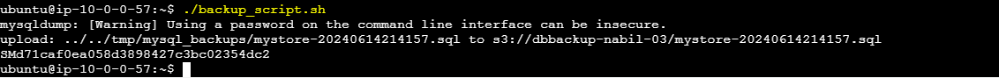

2. **Check Logs**:
   Verify the cron logs:

   ```sh
   grep CRON /var/log/syslog
   ```

   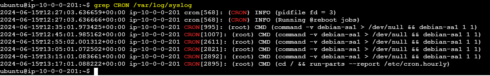

3. **Check WhatsApp**:
   Ensure you receive the WhatsApp notification on the specified number.

   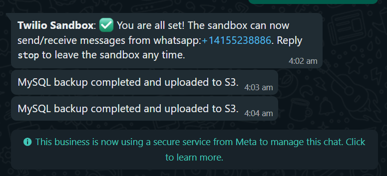

4. **Check S3 Bucket**:
   Verify the backup file is uploaded to the S3 bucket.

   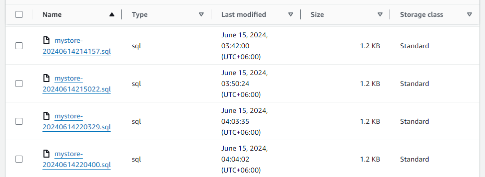

We can see that our script has been executed successfully and has pushed the MySQL backup dump into our S3 bucket.

## Conclusion

In this guide, we automated the process of backing up a MySQL database on an EC2 instance to an S3 bucket and set up notifications via WhatsApp using Twilio. This setup ensures regular and secure backups with immediate notifications, providing a robust solution for data management.